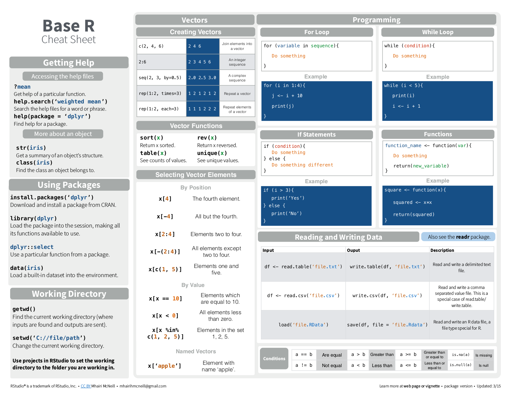
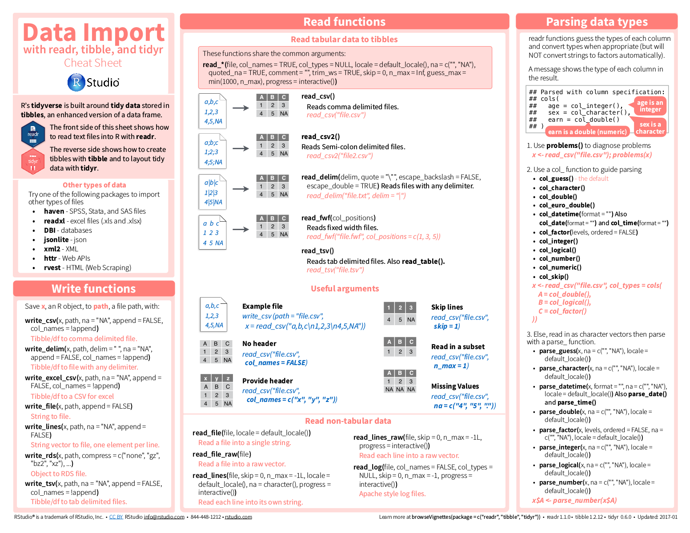
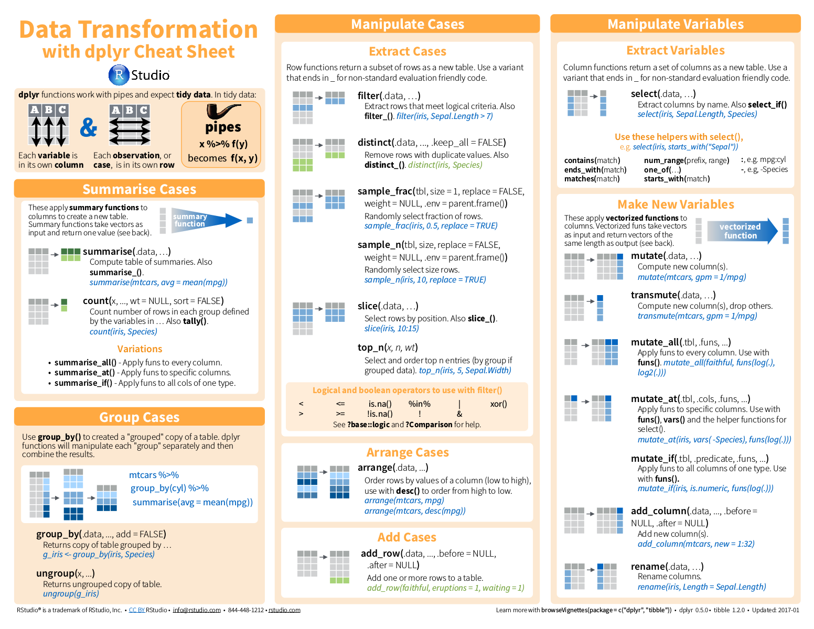
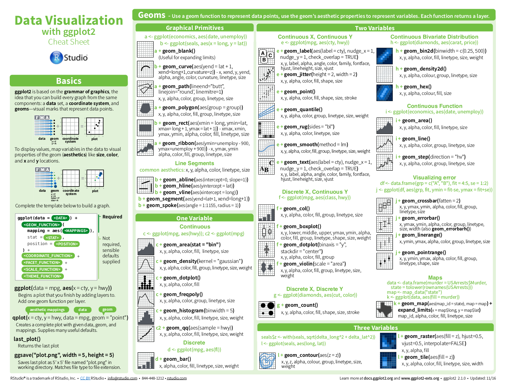

<style>
  #margin-15-percent > p {
    margin-top: 15%;
  }
  #margin-10-percent > p {
    margin-top: 10%;
  }
  #margin-5-percent > p {
    margin-top: 5%
  }
  #margin-0-percent > p {
    margin-top: 0%
  }
  #margin-minus5-percent > h3 {
    margin-top: -5%;
  }
</style>

## Get the slides

1. https://github.com/dlaehnemann/Tut_R_TidyData.git
2. "Clone or download"
3. "Download ZIP"

### git on Linux / OS X
```{bash, eval=FALSE}
cd YourFavoriteTutorialFolder
git clone https://github.com/dlaehnemann/Tut_R_TidyData.git
cd Tut_R_TidyData
firefox Tut_R_TidyData.html
```

### git on Windows

https://git-scm.com/download/win


# Part 1: Installing R and Rstudio

## Via Miniconda: (un)[Install Miniconda](https://conda.io/docs/install/quick.html)

```{r, echo=FALSE}
knitr::include_url("https://conda.io/docs/install/quick.html")
```

## Bioconda channel setup

```{r, echo=FALSE}
knitr::include_url("https://bioconda.github.io/#set-up-channels")
```

## Install R

### via Miniconda

```{bash, eval=FALSE}
conda install R
```

### stand-alone

```{r, echo=FALSE}
knitr::include_url("https://cran.rstudio.com/")
```

## Install Rstudio

```{r, echo=FALSE}
knitr::include_url("https://www.rstudio.com/products/rstudio/download/#download")
```

# Part 2: R(studio) basics

## Cheat Sheets for Basic R and Data IO, Transformation & Viz

```{r, echo=FALSE}
knitr::include_url("https://www.rstudio.com/resources/cheatsheets/")
```

## [Basic R syntax](http://github.com/rstudio/cheatsheets/raw/master/source/pdfs/base-r.pdf)

```{r, echo=FALSE, out.width="66%"}

```

## Rstudio

### Keyboard shortcuts

```
Alt + Shift + K
```

### Explore

1. create new script
2. use help on console, e.g. `?sum()` or `?mtcars`
3. look at data table, e.g. `View(mtcars)`
4. explicitly load something into your environment, e.g. `new <- mtcars`, and inspect
5. plot from script, e.g. `ggplot(data = mtcars) + geom_bar( aes(x = cyl, fill = am) )`

# Part 3: Tidy Data and the Tidyverse

## Tidy Data
http://r4ds.had.co.nz/

```{r, echo=FALSE, out.width="100%"}
knitr::include_graphics("http://r4ds.had.co.nz/images/tidy-1.png")
```

## easy-to-use R packages for data analysis:

```{r, echo=FALSE}
knitr::include_url("http://tidyverse.org/")
```

## The tidyverse metapackage

```{r, eval=FALSE}
install.packages("tidyverse")
```

```{r}
library(tidyverse)
```

# Part 4: Try it out

## [Data Import (and Export)](https://github.com/rstudio/cheatsheets/raw/master/source/pdfs/data-import-cheatsheet.pdf)

```{r, echo=FALSE, out.width="66%"}

```

## [Data Wrangling > Tidy Data](https://github.com/rstudio/cheatsheets/raw/master/source/pdfs/data-transformation-cheatsheet.pdf)

```{r, echo=FALSE, out.width="66%"}

```

## [Data Visualisation](https://www.rstudio.com/wp-content/uploads/2016/11/ggplot2-cheatsheet-2.1.pdf)

```{r, echo=FALSE, out.width="66%"}

```

# P.S.: Rmarkdown + ioslides

### Rmarkdown: http://rmarkdown.rstudio.com/
* https://www.rstudio.com/wp-content/uploads/2016/03/rmarkdown-cheatsheet-2.0.pdf

### Rmarkdown ioslides:
* http://rmarkdown.rstudio.com/ioslides_presentation_format.html

## HowTo produce these slides

```{r, eval = FALSE}
git clone https://github.com/dlaehnemann/Tut_R_TidyData
cd Tut_R_TidyData
# Edit Tut_R_TidyData.Rmd
R
> install.packages("rmarkdown")
> library("rmarkdown")
> library("knitr")
> render("Tut_R_TidyData.Rmd")
q()
```
 Open the provided or your produced `Tut_R_TidyData.html` with any current web browser.
